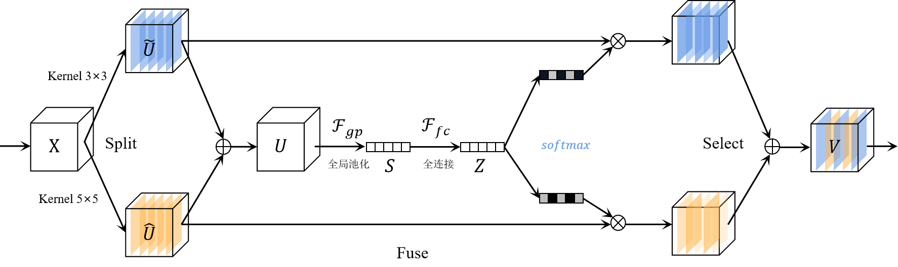
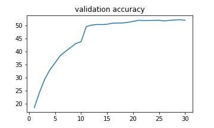
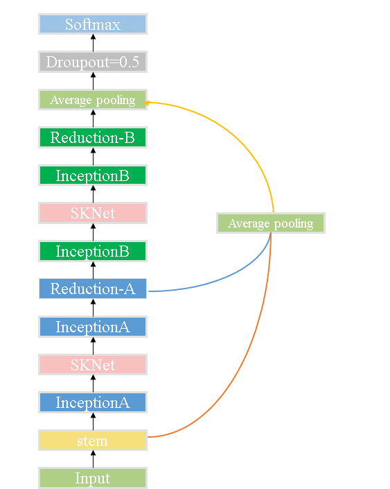
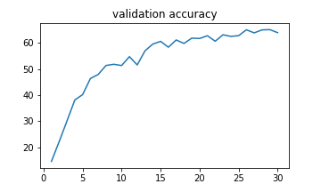

# READ ME

> 2013551 雷贺奥

作者的工作主要为以下三点

* 实现Resnet18
* 复现SKnet
* 将SKnet与Inception-v4 进行结合，对模型进行优化

这里主要说明复现的SKnet和 SKnet与inception-v4的结合优化

## SKnet

SKnet的关键在于SKnet的多个大小不同卷积核对输入进行特征提取，最后，依据权重将提取到的特征重新拼接成与输入维度相同的特征。

最终的训练结果如下所示：

SKnet20最终正确率稳定在51%，本次实验并没有采用训练过程中采用过多的tricks，只采用了**动态学习率**，对模型的训练过程进行优化，相较于原来的（47%），还是有较大的提升。

## SKnet combine Inception-v4

通过阅读论文(Feature fusion and kernel selective in Inception-v4 network)[1](#refer-anchor-1)，作者发现可以将SKnet中的SK 卷积核提取特征用于Inception-v4的结构，对SKnet进行优化。

最终训练结果如下所示：

最终正确率稳定在63%，较于原版的SKnet具有较大的准确率提升，优化效果良好。

## 参考文献

- [1] [Feature fusion and kernel selective in Inception-v4 network](https://www.sciencedirect.com/science/article/abs/pii/S1568494622000965)

  
